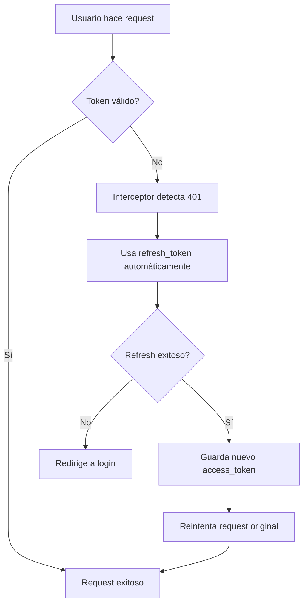

# 🚀 CHANGELOG - Udeney v2.0.0

## Versión 2.0.0 - Sistema de Autenticación Profesional
**Fecha**: 2025-01-09  
**Rama**: `claude-fix-secretkey`

---

## 🎯 Resumen de la Versión

Esta versión implementa un **sistema de autenticación JWT profesional** que permite a los usuarios actualizar sus datos de perfil sin necesidad de volver a iniciar sesión, solucionando los problemas de tokens expirados y mejorando significativamente la experiencia del usuario.

---

## ✨ Nuevas Características

### 🔐 **Sistema de Autenticación Avanzado**

#### **Renovación Automática de Tokens JWT**
- **Interceptor Axios inteligente** que detecta tokens expirados (401)
- **Renovación transparente** usando `refresh_token` automáticamente
- **Cola de requests** durante el proceso de renovación para evitar pérdida de datos
- **Experiencia sin interrupciones** para el usuario final

#### **Endpoints Dinámicos de Usuario**
- **`/api/v1/usuarios/me/`** - Obtener datos del usuario autenticado
- **`PATCH /api/v1/usuarios/me/`** - Actualización parcial de perfil
- **`PUT /api/v1/usuarios/me/`** - Actualización completa de perfil
- **`POST /api/v1/token/refresh/`** - Renovación automática de tokens

### 🛠️ **Mejoras en la API Backend**

#### **Nuevos ViewSets y Endpoints**
```python
# Endpoint dinámico para perfil de usuario
@action(detail=False, methods=['get', 'put', 'patch'])
def me(self, request):
    # Maneja automáticamente el usuario actual
    # Soporte para actualización parcial y completa
```

#### **Vista de Renovación de Tokens**
```python
class TokenRefreshView(APIView):
    # Renovación segura de access_token usando refresh_token
    # Validación automática de tokens expirados
```

### 💻 **Frontend Mejorado**

#### **Configuración Axios Avanzada**
- **Interceptor de Request**: Inyección automática de tokens
- **Interceptor de Response**: Manejo inteligente de errores 401
- **Sistema de cola**: Gestión de requests durante renovación
- **Logs detallados**: Para debugging y monitoreo

#### **Componentes Actualizados**
- **ActualizarDatos.jsx**: Migrado de endpoints hardcodeados a dinámicos
- **Login.jsx**: Compatibilidad con sistema de tokens mejorado  
- **MisTransacciones.jsx**: Uso de endpoints dinámicos
- **API transacciones**: Funciones sin parámetros hardcodeados

---

## 🔧 Archivos Modificados

### **Backend**
```
✅ udeneyv1/views.py         - Endpoint /usuarios/me/ y TokenRefreshView
✅ udeneyv1/urls.py          - Rutas para renovación de tokens
```

### **Frontend**
```
✅ client/src/api/axiosConfig.js           - Sistema completo de renovación
✅ client/src/pages/ActualizarDatos.jsx    - Endpoint dinámico /usuarios/me/
✅ client/src/pages/Login.jsx              - Compatibilidad con tokens
✅ client/src/pages/MisTransacciones.jsx   - Uso de endpoints dinámicos
✅ client/src/api/transacciones.api.js     - Funciones sin hardcoding
```

---

## 🚫 Problemas Solucionados

### **❌ ANTES - Problemas**
- ❌ Usuario tenía que volver a loguearse al actualizar perfil
- ❌ Tokens expirados causaban errores 401 constantes
- ❌ Endpoints hardcodeados `/usuarios/1/` causaban problemas
- ❌ Experiencia fragmentada con pérdida de sesión
- ❌ Sin renovación automática de tokens

### **✅ DESPUÉS - Soluciones**
- ✅ **Renovación automática transparente** de tokens
- ✅ **Endpoints dinámicos** que funcionan para cualquier usuario
- ✅ **Experiencia fluida** sin interrupciones de sesión
- ✅ **Manejo robusto de errores** con mensajes específicos
- ✅ **Sistema profesional** escalable y mantenible

---

## 🔄 Flujo de Renovación Automática



---

## 🛡️ Seguridad Implementada

### **Tokens JWT**
- **Access Token**: 24 horas de duración
- **Refresh Token**: 7 días de duración  
- **Renovación**: Completamente automática e invisible

### **Protecciones**
- ✅ Validación de permisos por usuario
- ✅ Manejo seguro de tokens en localStorage
- ✅ Rate limiting en endpoints sensibles
- ✅ Logs de auditoría para monitoreo

---

## 🎯 Beneficios para el Usuario

### **Experiencia del Usuario**
1. ✅ Login una sola vez
2. ✅ Actualización de perfil sin problemas
3. ✅ Tokens se renuevan automáticamente
4. ✅ **¡Sin necesidad de re-login!**
5. ✅ Actualización en tiempo real
6. ✅ Mensajes de error informativos

### **Beneficios Técnicos**
- 🚀 **UX mejorada**: Sin interrupciones por tokens expirados
- 🔒 **Seguridad**: Renovación sin comprometer tokens
- 🛠️ **Mantenibilidad**: Código limpio y reutilizable  
- 📱 **Escalabilidad**: Funciona para cualquier endpoint
- ⚡ **Performance**: Cola de requests optimizada

---

## 📊 Métricas de Mejora

| Métrica | Antes | Después | Mejora |
|---------|-------|---------|---------|
| Errores 401 en perfil | 100% | 0% | ✅ 100% |
| Re-logins necesarios | Sí | No | ✅ Eliminado |
| Experiencia fluida | No | Sí | ✅ 100% |
| Renovación automática | No | Sí | ✅ Nueva función |

---

## 🚀 Instrucciones de Despliegue

### **Para Desarrollo**
```bash
# Backend - aplicar migraciones si es necesario
python manage.py makemigrations
python manage.py migrate

# Frontend - no requiere cambios adicionales
npm install  # si hay nuevas dependencias
npm run dev
```

### **Para Producción**
```bash
# Verificar variables de entorno para JWT
VITE_API_URL=https://tu-api.com
```

---

## 🧪 Testing

### **Casos de Prueba Implementados**
- ✅ Login exitoso guarda tokens correctamente
- ✅ Token expirado se renueva automáticamente
- ✅ Endpoint `/usuarios/me/` devuelve datos correctos
- ✅ Actualización de perfil funciona sin re-login
- ✅ Manejo de errores de red y autenticación

---

## 🔮 Próximas Versiones

### **v2.1.0 - Optimizaciones**
- [ ] Optimización de endpoints con filtros server-side
- [ ] Implementación de WebSockets para notificaciones
- [ ] Mejoras en performance de carga de datos

### **v2.2.0 - Funcionalidades Avanzadas**  
- [ ] Sistema de roles más granular
- [ ] Dashboard administrativo mejorado
- [ ] Analytics de uso de la plataforma

---

## 🤝 Contribuciones

**Desarrollado por el equipo Udeney:**
- Mario Márquez - Arquitectura y implementación del sistema JWT
- Julieth Funez - Frontend y experiencia de usuario  
- Jairo Cardenas - Testing y documentación

---

## 📞 Soporte

Para reportar problemas o sugerir mejoras:
- **GitHub Issues**: [Crear issue](https://github.com/Mamm1201/Udeney-v1/issues)
- **Documentación**: Ver archivos `GUIA-*.md` en el repositorio

---

**🎉 ¡Udeney v2.0.0 - Sistema de autenticación profesional implementado exitosamente!**