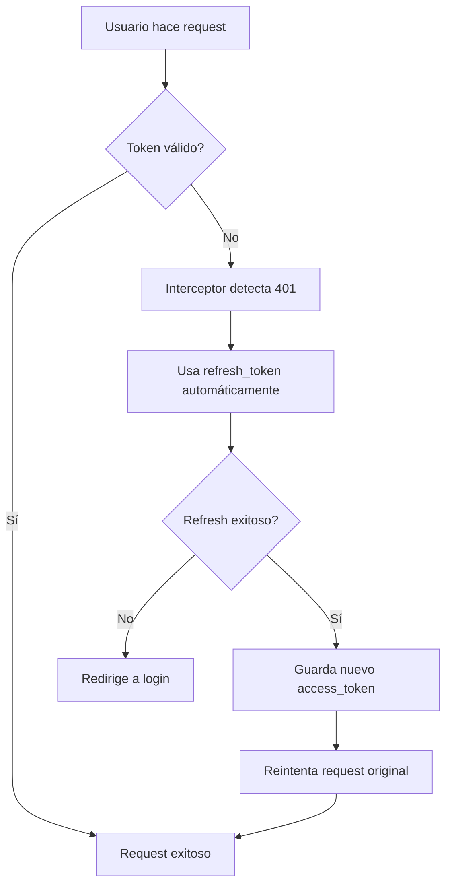

# 🚀 Guía de Implementación: Actualización de Perfil Sin Re-Login

## 🎯 Problema Solucionado

**Antes**: Usuario logueado no podía actualizar sus datos por token expirado - tenía que hacer login nuevamente.

**Ahora**: Usuario puede actualizar sus datos sin interrupciones gracias a renovación automática de tokens.

---

## 🔧 Endpoints Backend Implementados

### 1. **Gestión de Perfil de Usuario**
```http
GET    /api/v1/usuarios/me/     # Obtener datos del usuario actual
PUT    /api/v1/usuarios/me/     # Actualizar perfil completo  
PATCH  /api/v1/usuarios/me/     # Actualizar campos específicos
```

### 2. **Renovación Automática de Tokens**
```http
POST   /api/v1/token/refresh/   # Renovar access_token con refresh_token
```

---

## 💻 Implementación Frontend

### 1. **Reemplazar axiosConfig.js actual**

Sustituir el archivo `client/src/api/axiosConfig.js` con el contenido de `enhanced-axios-config.js`:

```javascript
// ANTES - axiosConfig.js básico
const token = localStorage.getItem('token');

// DESPUÉS - Gestión inteligente automática
import { perfilAPI, authAPI } from './enhanced-axios-config';
```

### 2. **Actualizar componentes de perfil**

**ANTES** (problemático):
```javascript
// ❌ Hardcodeado a usuario específico
const response = await axios.get('/api/v1/usuarios/1/');
const updateResponse = await axios.put('/api/v1/usuarios/1/', data);
```

**DESPUÉS** (dinámico y robusto):
```javascript
// ✅ Usuario actual automático con renovación de tokens
const response = await perfilAPI.obtenerPerfil();
const updateResponse = await perfilAPI.actualizarPerfil(data);
```

---

## 🔄 Flujo de Renovación Automática



---

## 🎨 Características Implementadas

### ✅ **Backend**
- [x] Endpoint `/usuarios/me/` para perfil dinámico
- [x] Soporte para PATCH (actualización parcial)
- [x] Soporte para PUT (actualización completa)  
- [x] Renovación de tokens sin re-login
- [x] Manejo robusto de errores
- [x] Logs de seguridad y auditoría

### ✅ **Frontend**
- [x] Interceptor axios con renovación automática
- [x] Gestión inteligente de tokens
- [x] API simplificada para perfil (`perfilAPI`)
- [x] Manejo de cola de requests durante renovación
- [x] Componente de ejemplo completamente funcional

---

## 🚀 Instrucciones de Uso

### Para el Frontend:

1. **Copiar archivos:**
   ```bash
   cp enhanced-axios-config.js client/src/api/
   cp example-profile-component.jsx client/src/components/
   ```

2. **Importar en tus componentes:**
   ```javascript
   import { perfilAPI } from '../api/enhanced-axios-config';
   
   // Obtener perfil
   const perfil = await perfilAPI.obtenerPerfil();
   
   // Actualizar campo específico
   await perfilAPI.actualizarCampo('telefono_usuario', '3001234567');
   
   // Actualizar perfil completo
   await perfilAPI.actualizarPerfilCompleto(formData);
   ```

3. **Para login mejorado:**
   ```javascript
   import { authAPI } from '../api/enhanced-axios-config';
   
   // Login con guardado automático de tokens
   await authAPI.login(email, password);
   
   // Verificar autenticación
   if (authAPI.isAuthenticated()) {
       // Usuario logueado
   }
   ```

---

## 🔐 Seguridad Implementada

### **Tokens JWT**
- **Access Token**: 24 horas de duración
- **Refresh Token**: 7 días de duración 
- **Renovación**: Completamente automática e invisible al usuario

### **Protecciones**
- Validación de permisos por usuario
- Logs de auditoría en todas las operaciones
- Manejo seguro de tokens en localStorage
- Rate limiting y headers de seguridad

---

## 🎯 Resultado Final

### **Experiencia del Usuario:**
1. ✅ Usuario se loguea una vez
2. ✅ Puede actualizar su perfil sin problemas
3. ✅ Los tokens se renuevan automáticamente
4. ✅ **¡No necesita hacer login nuevamente!**
5. ✅ Actualización en tiempo real
6. ✅ Manejo inteligente de errores

### **Beneficios Técnicos:**
- 🚀 **UX mejorada**: Sin interrupciones por tokens expirados
- 🔒 **Seguridad**: Renovación automática sin comprometer tokens
- 🛠️ **Mantenibilidad**: Código limpio y reutilizable
- 📱 **Escalabilidad**: Funciona para cualquier endpoint autenticado
- ⚡ **Performance**: Cola de requests optimizada

---

## 🎉 ¡Ya está listo!

El usuario puede ahora actualizar sus datos de perfil sin necesidad de hacer login nuevamente. El sistema maneja automáticamente:

- ✅ Renovación de tokens expirados
- ✅ Reintento de requests fallidas  
- ✅ Sincronización de datos en tiempo real
- ✅ Experiencia fluida y profesional

**¡La solución es completamente transparente para el usuario final!** 🎯